# Chat App

A chat app developed with Firebase and Flutter.

Inspired by the design of Alex Hylton, design available at [Chatting App UI kit - Chatbox](https://www.figma.com/community/file/1152599900945065665).

#### This project has the objetive of:
- Try the Clean Architecture with Riverpod.
- Practice the login with Google using Firebase Auth.
- Try the login using email and password using Firebase Auth.
- Practice to replicate screens to the app by using a Figma project.
- Practice Firebase Firestore to store user, chats, messages and stories data.
- Try Firebase Storage to store media sent by users and Stories *(Used Cloudinary instead)*.

## Functionalities
- Users
    - Login with Google. 
    - Login and signup with email and password. 
- Friends Requests
    - Send friend requests to another accounts.
    - Accept or decline friend requests by another accounts.
- Chats
    - Send and receive text privately with friend.
    - Create groups with your friends.
    - Send and receive text messages in groups with friends.
    - Send media in private chats or groups. *(using cloudinary)*
- Messages
    - See if your friend saw your private message.
    - See who saw your message in the group.
- Stories
    - Post stories for friends.
    - List the stories of your friends.
    - Like your friends stories.
- App Language
    - Be able to change the app language.
    - Support English.
    - Support Brazilian Portuguese.
- App Theme
    - Be able to change the app theme mode.
    - Support light theme mode.
    - Support dark theme mode.
    - Support system theme mode.

## Screenshots

### Onboarding screen
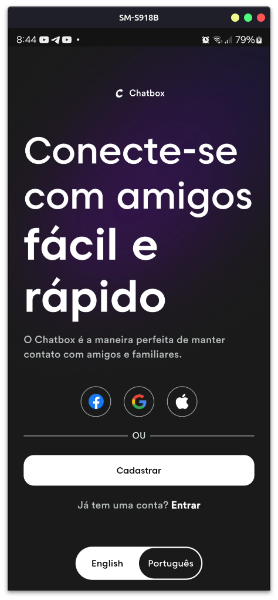

### Log in screen
<div style="display: flex; gap: 10px;">
    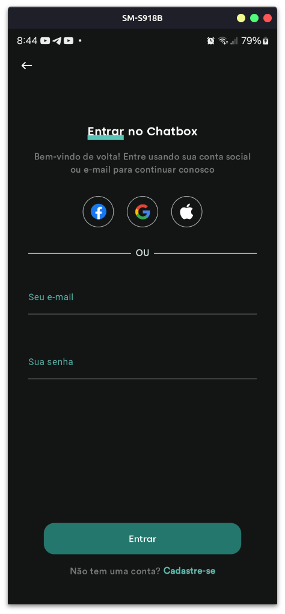
    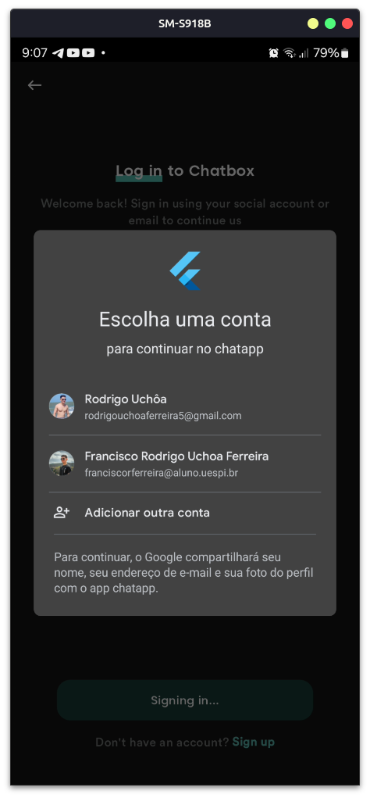
</div>


### Sign in screen
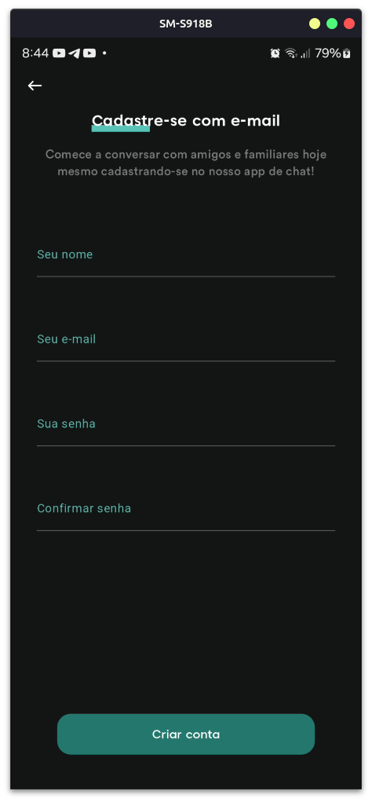

### Home screen
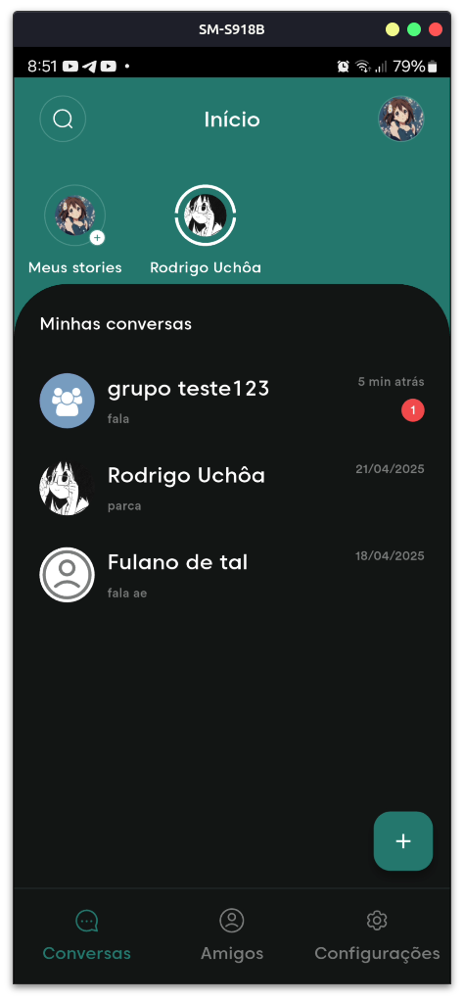

### Story screen
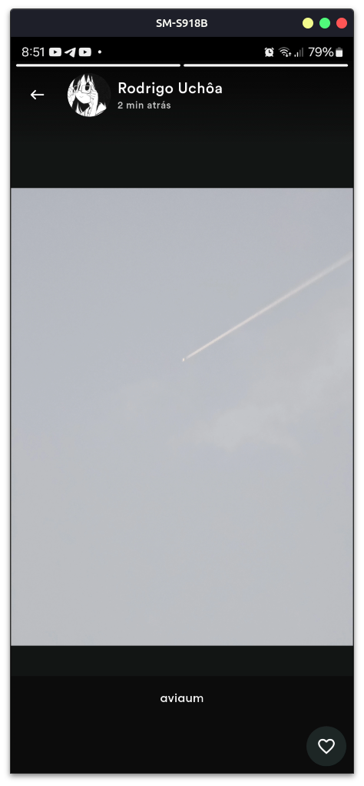

### Chat screen
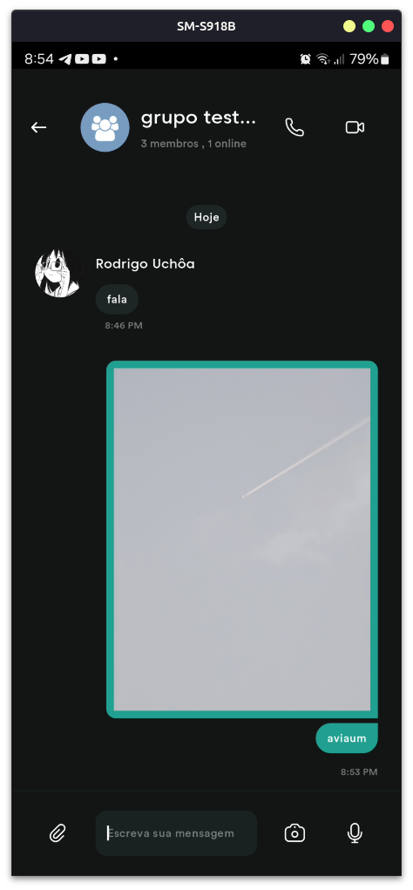

### New group screen
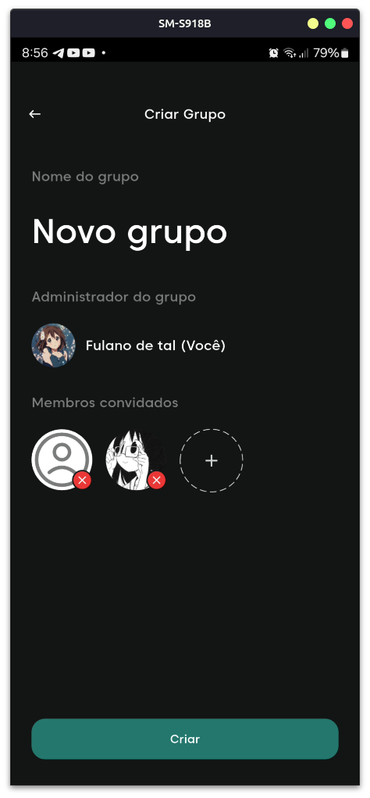

### Friends screen
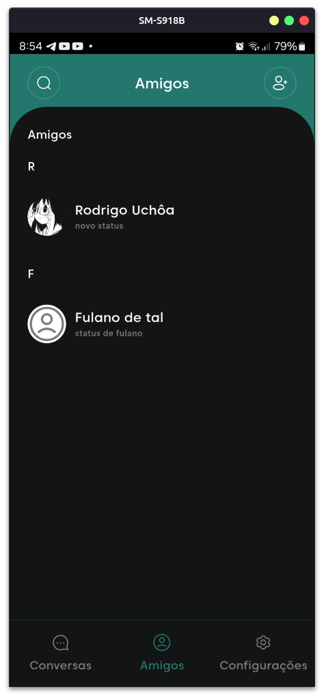

### Search friends and chats screen
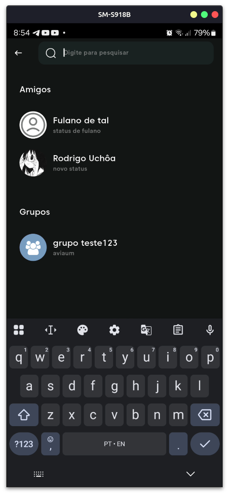

### Settings screen
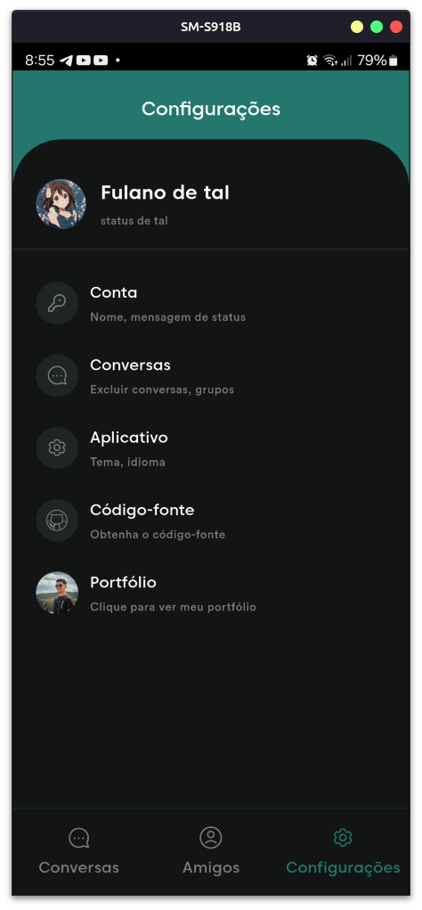

### App settings screen
<div style="display: flex; gap: 10px;">
    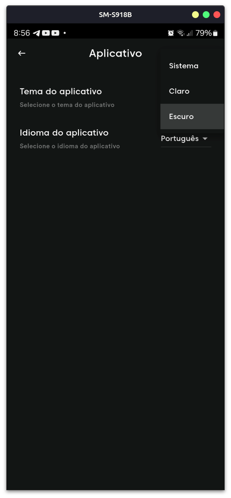
    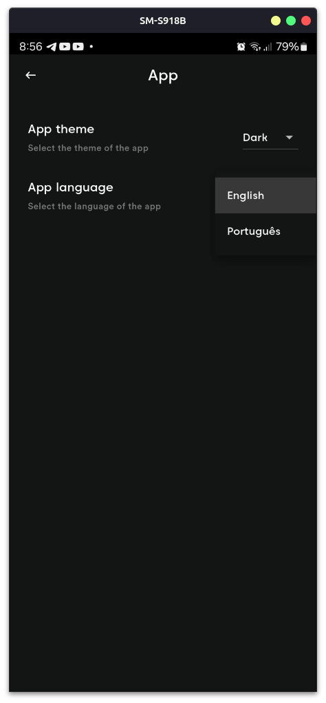
</div>

## Build

To build, you need to initialize the Firebase in the app with your own Firebase Project. For this, use [FlutterFire](https://firebase.flutter.dev/docs/cli/).

To make the media sending functionality to work, you must create an account on Cloudinary (It's free). After that, get the Cloud Name, API Key and API Secret and put in a *.env* file, in the project root, like that:

```bash
CLOUDINARY_CLOUD_NAME="abcde123"
CLOUDINARY_API_KEY="abcde123"
CLOUDINARY_API_SECRET="abcde123"
```

Finally, run the app pressing *F5* key on vscode, or with this command: 

```bash
flutter run
```